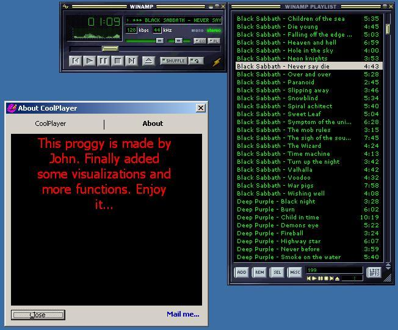



## CoolPlayer \(Winamp clone with visualization & with DDE\)

### Description

Winamp clone with many many options and functions. Skins used from winamp, plugin with visualization, another plugin with runtimes, skin browser, program function, an may many more options and functions to enjoy...
 
### More Info
 

             |
---                |---
**Submitted On**   |2003-02-25 01:54:46
**By**             |[Giannis\_B](https://github.com/Planet-Source-Code/PSCIndex/blob/master/ByAuthor/giannis-b.md)
**Level**          |Intermediate
**User Rating**    |4.7 (66 globes from 14 users)
**Compatibility**  |VB 6\.0
**Category**       |[Sound/MP3](https://github.com/Planet-Source-Code/PSCIndex/blob/master/ByCategory/sound-mp3__1-45.md)
**World**          |[Visual Basic](https://github.com/Planet-Source-Code/PSCIndex/blob/master/ByWorld/visual-basic.md)
**Archive File**   |[CoolPlayer1550082252003\.zip](https://github.com/Planet-Source-Code/giannis-b-coolplayer-winamp-clone-with-visualization-with-dde__1-43506/archive/master.zip)

